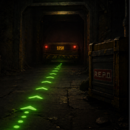

# REPOPathfinder

[**Get it on Thunderstore**](https://thunderstore.io/c/repo/p/MentalizePez/REPOPathfinder/)



A BepInEx plugin for R.E.P.O. that renders an in-world dot trail along the NavMesh path to the current extraction point — or back to the truck once all extractions are complete. It mirrors the same target-selection logic the in-map "backtrack" dots use, projected into world space so you can follow it without opening the map.

**Live release:** [thunderstore.io/c/repo/p/MentalizePez/REPOPathfinder](https://thunderstore.io/c/repo/p/MentalizePez/REPOPathfinder/) — published under the author handle MentalizePez, install via Thunderstore Mod Manager or by dropping the DLL into BepInEx (see [Install](#install)).

Hotkeys (configurable, all default to F-keys):

- **F4** — toggle the trail on / off.
- **F5** — switch the destination between **Auto** (game-driven: current extraction, or truck when all are complete) and **Truck** (forces the truck regardless of extraction state, for going back to charge items mid-run). Choice persists.
- **F6** — open the customization panel: RGBA color sliders, hex input, color presets, and live sliders for dot size / flow speed / spacing. Edits write back to the BepInEx config so they persist across sessions.

## Approach, tools, and assumptions

**Approach.** The in-game map already has dot guidance to the current extraction point; this plugin observes the same game state and projects that path into world space. The interesting design question was *how* to do that without the dots jittering every time the player moved — the naive approach (recompute the NavMesh path from the player to the target every 250 ms and re-render dots in arc-distance from the player) translates the entire trail forward in one frame at every recompute. The shipped design instead caches the path corners in absolute world coordinates and each frame projects the player onto that cached polyline to find a `playerArc` scalar. Dots are placed at world positions derived from the cached corners; walking forward changes only `playerArc`, never the dots' world positions. Recompute fires only on target identity change or when the player drifts past a configurable distance from the cached path. See [Path computation](#path-computation) for the math.

**Tools.**
- C# / .NET Standard 2.1, BepInEx 5.4.2100 (Mono build — not IL2CPP).
- HarmonyX 2.10 for Unity `Input` / `InputAction` patching (the customize-panel input blocker only — REPO's own code is never patched).
- Unity 2022.3.21 modules (compile-only references via `UnityEngine.Modules` NuGet).
- Unity `NavMesh.CalculatePath` for path queries, IMGUI for the customization overlay, `MaterialPropertyBlock` for per-dot color/alpha without per-dot material allocations.
- Build via `dotnet build -c Release`; the csproj's `ThunderstorePack` target produces a ready-to-upload zip alongside the DLL.

**Assumptions.**
- REPO is Mono-BepInEx — reflection on `internal` fields (`PlayerAvatar.LastNavmeshPosition`, `RoundDirector.extractionPointCurrent`, `RoundDirector.allExtractionPointsCompleted`) works at runtime without IL2CPP shimming.
- REPO's NavMesh is baked statically per level; the plugin calls `NavMesh.CalculatePath` for its own visualization but never bakes or modifies the NavMesh.
- `RoundDirector.instance` and `LevelGenerator.Instance.LevelPathTruck` are populated and Photon-replicated by the time the plugin's per-frame `Update()` runs.
- `Shader.Find("Sprites/Default")` exists in REPO's Unity build; a fallback chain to `Unlit/Color` then `Standard` is included for robustness.
- The mod is purely client-side: each player observes the shared game state independently and renders only their own dots — no RPCs, no Photon traffic.

## What the DLL actually does

On plugin `Awake()`, it:

- **Reads its config.** A standard BepInEx config file (`BepInEx/config/isaia.repopathfinder.cfg`) defines all hotkeys, dot visuals, animation tunables, and the path-recompute threshold. A `[Internal] ConfigVersion` key migrates stale defaults from prior versions in place — values that exactly match a previous default get overwritten with the current default; user-customized values are left alone.
- **Creates a `DontDestroyOnLoad` `GameObject`.** Adds two `MonoBehaviour`s to it: `PathfinderManager` (path / animation / rendering) and `PathfinderCustomizeUI` (the F6 IMGUI overlay).
- **Installs Harmony input-blocking patches.** `InputBlocker` is gated on a single static `BlockInput` flag flipped by the customize UI; it is inert when the menu is closed. While the menu is open, the following are short-circuited so cursor movement doesn't drive the camera and clicks don't fire weapons:
  - Legacy: `UnityEngine.Input.GetAxis`, `GetAxisRaw`, `GetMouseButton`, `GetMouseButtonDown`, `GetMouseButtonUp` — return `0f` / `false`.
  - New: `UnityEngine.InputSystem.InputAction.ReadValue<T>()` for `Vector2`, `float`, and `Vector3` — return `default(T)`. Bound dynamically via reflection, so the plugin still loads if the new InputSystem assembly is absent.
  - `Input.GetKey` / `GetKeyDown` / `GetKeyUp` are deliberately **not** patched, so F4 / F5 / F6 keep working.

## Path computation

The path is **cached** in world space, not recomputed every frame:

1. **Target resolution.** Auto mode: `RoundDirector.allExtractionPointsCompleted` (read by reflection) → `LevelGenerator.LevelPathTruck.transform.position`; otherwise `RoundDirector.extractionPointCurrent.transform.position`. Truck mode: always `LevelPathTruck`. Identity is the `ExtractionPoint` reference or the literal string `"truck"`.
2. **Recompute trigger.** A new path is computed only when:
   - There is no cached path yet,
   - The target identity changed (different extraction, or Auto↔Truck flip),
   - The player has drifted further than `OffPathRecomputeThresholdMeters` (default `3.0`) from the cached polyline (closest-point-on-line-segment over each cached segment), or
   - A scene change invalidated the cache.
3. **Compute & cache.** `NavMesh.CalculatePath(playerNavmeshPos, targetPos, AllAreas, path)` is called once. The corners and prefix arc-distances are stored; the displayed dots reference these stable world-space points for as long as the cache lives. `playerNavmeshPos` is `PlayerAvatar.LastNavmeshPosition` (read by reflection — internal field).
4. **Each frame.** The player is projected onto the cached polyline to produce a `playerArc` scalar; that's the trail's "back end". Walking forward changes only `playerArc`; the cached corners are untouched, so dot world positions stay stable regardless of how the player moves.

## Animation & rendering

- A pool of `MaxDots` (default 30) sphere primitives, colliders stripped, sharing one material with per-dot color set via `MaterialPropertyBlock`.
- A single shared `_animOffset` ∈ [0, spacing) advances by `FlowSpeed` m/s. When it crosses `spacing` the circular pool pointer `_frontPool` decrements, which makes every sphere's slot index increment by 1 simultaneously. Spacing stays perfectly even regardless of how `availableLength = totalLength - playerArc` changes.
- The single sphere whose slot wraps from `MaxDots-1` to `0` per cycle has its smoothing flag cleared in the same step, so it snaps to its new position at the player end of the trail instead of being lerped across the room.
- World position per dot: `CachedPointAtDistance(playerArc + slot*spacing + animOffset)`, plus `GroundOffset` on Y. The result is exponentially smoothed toward the displayed position with rate `PositionSmoothRate` (default `25` 1/s) for the rare cases where the path is re-cached.
- Alpha fade per dot: `min(SmoothStep(0..fadeZone, d), SmoothStep(0..fadeZone, endpoint-d))` where `d = slot*spacing + animOffset`, `endpoint = min(availableLength, MaxDots*spacing)`, `fadeZone = spacing * FadeZoneFraction`. Hides the wrap and the path's own ends behind alpha-0 transitions.
- Material shader is resolved at runtime via `Shader.Find("Sprites/Default") ?? Shader.Find("Unlit/Color") ?? Shader.Find("Standard")`. `_ZWrite` 0 and `SrcAlpha`/`OneMinusSrcAlpha` blend are set if the chosen shader exposes those properties; render queue is `3500`.

## Customization UI

`PathfinderCustomizeUI` (default F6) is a draggable `GUILayout.Window`:

- RGBA sliders (0–255 readout), `#RRGGBBAA` text field with **Apply**, preview swatch over a white underlay so transparency is obvious, eight color presets.
- Sliders for `DotScale`, `FlowSpeedMetersPerSec`, `SpacingMeters`.
- **Reset Visuals** writes each of the above ConfigEntries back to its `DefaultValue`. **Close** dismisses the panel.
- All edits go straight to the BepInEx ConfigEntries. `PathfinderManager` subscribes to `DotColorHex.SettingChanged` so the cached `_baseColor` refreshes the moment a slider moves; size / flow / spacing are read from config every frame and update for free.
- On open: cached `Cursor.lockState` and `Cursor.visible` are saved, then forced to `None` / `true` so the cursor is interactable. On close: the saved values are restored. `InputBlocker.BlockInput` is flipped in lockstep with visibility.

## Install

Thunderstore Mod Manager: open the [live release](https://thunderstore.io/c/repo/p/MentalizePez/REPOPathfinder/) and click Install. Manual: drop `REPOPathfinder.dll` into `<profile>/BepInEx/plugins/REPOPathfinder/`. Requires `BepInEx-BepInExPack`.

## Building from source

**Prerequisites.**
- .NET SDK 6.0 or newer (verify with `dotnet --version`).
- A local R.E.P.O. install. The csproj defaults to `C:\Program Files (x86)\Steam\steamapps\common\REPO` for its `Assembly-CSharp.dll` reference; override on the build command line with `-p:REPOPath="<your install root>"` if your install lives elsewhere.

**Build.**

```
dotnet build -c Release
```

**Output.**
- `bin/Release/netstandard2.1/REPOPathfinder.dll` — the plugin binary.
- `dist/REPOPathfinder-<version>.zip` — Thunderstore-ready bundle (DLL + `manifest.json` + `README.md` + `icon.png` if present at repo root), produced by the `ThunderstorePack` MSBuild target.

To run locally: drop the DLL into `<BepInEx profile>/BepInEx/plugins/REPOPathfinder/` and launch the game. To publish: upload the zip via the Thunderstore web uploader.

## Compatibility

- **Client-side.** The plugin is purely local: it reads `PlayerController.instance.playerAvatarScript`, `RoundDirector.instance`, and `LevelGenerator.Instance` to compute its own path and renders its own GameObjects. No RPCs, no Photon traffic. Each player can install independently; nothing about the plugin requires the host or other clients to have it.
- **No Harmony patches on REPO code.** Harmony prefixes target only `UnityEngine.Input` (legacy) and `UnityEngine.InputSystem.InputAction.ReadValue<T>()` (new). REPO's own classes are read via reflection (for `internal` fields) but are never patched.
- **No NavMesh modifications.** The plugin calls `NavMesh.CalculatePath` for itself; it does not bake or alter the game's NavMesh.

## Changelog

### 0.7.2
- Ported the InputBlocker pattern from REPOBlacklist so dragging customize-panel sliders no longer rotates the camera or fires weapons. Harmony prefixes on legacy `Input.*` axis / mouse-button reads and on `InputAction.ReadValue<Vector2/float/Vector3>()` (bound via reflection); `GetKey*` deliberately untouched so hotkeys still work.

### 0.7.1
- Fixed long-path "conveyor belt" rubber-banding: when `activeCount == MaxDots`, the wrapping dot's slot transitioned `MaxDots-1 → 0` while staying inside the visible branch, so the smoothing lerp animated it across the entire trail length. The frontPool decrement now also clears `_wasVisible` for the pool index that just wrapped, forcing a snap.

### 0.7.0
- Added the F6 customization UI: RGBA sliders, hex input, eight color presets, dot-size / flow-speed / spacing sliders, Reset Visuals, all live-bound to the BepInEx ConfigEntries.
- `PathfinderManager` subscribes to `DotColorHex.SettingChanged` and refreshes its cached `_baseColor` immediately, so dragging color sliders updates world dots on the same frame.

### 0.6.0
- Added F5 destination toggle: **Auto** (game-driven extraction → truck) and **Truck** (force truck regardless of extraction state). Mode is persisted as a `PathfinderTargetMode` ConfigEntry. Cache invalidated on toggle so the trail re-orients on the next frame.

### 0.5.0
- Replaced per-frame recompute with a cached path + per-frame player projection. Path is recomputed only on target identity change or when the player drifts more than `OffPathRecomputeThresholdMeters` from the cached polyline. Walking forward / backward along the path no longer translates dot world positions at all — the dots are nailed to absolute world coordinates; only their visibility shifts as the player walks past them.
- `RecalcIntervalSeconds` is now deprecated and ignored.

### 0.4.0
- Added per-dot exponential-decay smoothing on world positions (`PositionSmoothRate`, default 25). `_wasVisible` flags reset on every path recompute and on hidden→visible transitions so wraps still snap rather than draw a curved interpolation across geometry.

### 0.3.0
- Replaced per-dot independent `d %= trailExtent` wrap with a shared `_animOffset` plus circular pool pointer `_frontPool`. Spacing now stays perfectly even regardless of how `availableLength` changes; previously a moving modulo divisor could shake dots off the spacing grid.
- Added config-version migration: stale `DotColorHex` / `DotScale` defaults from 0.1 / 0.2 are overwritten with the new defaults; user-customized values are preserved.

### 0.2.0
- Added continuous flow animation: `_animOffset` advances every frame and the trail recycles continuously instead of populating-then-disappearing in waves.
- Switched per-dot color updates to a single shared material plus `MaterialPropertyBlock` for alpha fade.
- Smaller / more translucent default dot visuals.

### 0.1.0
- Initial implementation: F4 toggle, NavMesh path computation from `PlayerAvatar.LastNavmeshPosition` to `RoundDirector.extractionPointCurrent` (or `LevelGenerator.LevelPathTruck` when all extractions are complete), primitive sphere pool with `Sprites/Default` material at render queue 3500.

## License

Copyright (c) 2026 Isaiah Anson. All rights reserved. You may use the released software for
personal, non-commercial use; copying, modifying or redistributing it requires written
permission. See [LICENSE](LICENSE).
